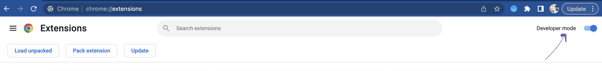

# Profile Connect Plus
Chrome extension that is able to send connection requests to a list of people in a LinkedIn search.

Greetings!!

I applied for a open position in a company and they have given me a take-home assignment and to upload src to GitHub.
The task is to create a chrome extension that's able to send connection requests to a list of people in a LinkedIn search.

I am completely new to chrome extension development(never ever attempted). But not to JavaScript huh!(That encouraged me).
So, started studying chrome extension official documentation(Obviously lol!). I got extension knowledge to a decent level and started hitting keyboard!.

I thought of two approaches,
First approach is:
1. Create a manifest.json file, which contains information about the extension, including its name, version, description, and permissions. (mandatory for any approach!)
2. Create a content script that will run on the LinkedIn search results page. This script will extract the information of the people I want to connect with and store it in an array or a JSON object in locaStorage.
3. Create a popup window that appears when the user clicks the extension icon. This popup will have a button that, when clicked, will trigger a function to send connection requests to the people in the localStorage array.
4. Use the LinkedIn API to send connection requests to the people in the array. (I will need to **obtain an access token to use the API**.)
5. Handle errors (--recommended!) and display feedback to the user about the success or failure of each connection request(--good approach!).

This seemed decent approach but whoever uses the extension need to obtain an access token prior, which is kind of a burden step. So thought second one.

Second one is:
1. same from first approach!. Create a manifest.json file, which contains information about the extension, including its name, version, description, permissions and content-script injection.
2. Create a name, a matching logo and a UI design for extension popup window.
3. Create a popup window as per design and,
    1. Establish connection between popup.js and content-script,js for continuous message exchange.
    1. Start button: upon clicking, sends "start" message to content-script.js
    2. Stop button: sends "stop" message to content-script.js
    3. Display total connection hit count recieved from content-script.js.
4. Create content-sript.js which recieves action message from popup.js, and perform DOM modification for interested elements.
5. Send back a message containing connection counts to popup.window.
5. Check for corner case scenarios handling at code level.

Test cases:
1. url matching for LinkedIn people search page. (handled in popup window).

2. setInterval() is used to give enough time to complete "connect" requests.
3. Hit connection only if "Connect" button present and skip for else buttons.
4. if Modal popup appears after connect button, then should click "Send now". (We can change this to "Add note" button and send customised message/note). 
5. 10 people appear on one search page and thus interval timer is set for 1 to 10 counts. (for 2nd page onwards, every pagination regenerates the popup window and thus new connection established with content-script.js and restart the timer.)
6. Should stop connection interval timer if recieved stop commands.
yet possible cases:
1. taking advantage of chrome.Localstorage to store total connection hit counts and skip count and display both of them, everytime popup is regenerated.
2. catching and handling api responded errors. And many...

limitations:
1. since using DOM manipulation technique, selecting elements by its name, tagname, querySelector or id is mandatory and if LinkedIn changes elements' names and tags anytime, then extension fails!
2. everytime refresh the current page before using the extension. (Need to work on that!).

**How to use?**

-- Clone the project or download zip format and extract downloaded zip.

-- Hit chrome://extensions/ on your browser and toggle "Developer mode" On.
    
    
-- Click "Load unpacked" button.
    
    
-- Select project folder and extension is loaded to chrome://extensions/
    
    
-- Refresh the extension and open LinkedIn search page.

-- Select people option.

-- open extension window from extensions area at the end of search url bar.

-- Start to see extension performance!

Thank you for Reading. I am open to suggestions, recommendations or ideas, please feel free to share if any.

My Email-ID: shreeheg@gmail.com.
